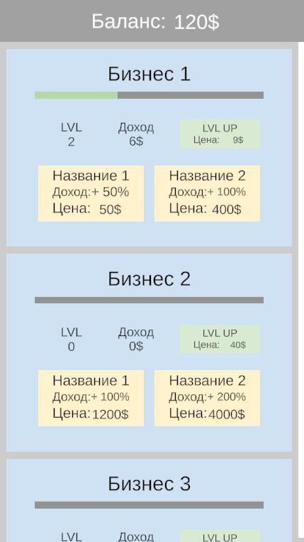

# test-idle-clicker #
Упрощенный прототип кликера, в котором игрок покупает и улучшает бизнесы, генерирующие доход.
[apk-билд](https://drive.google.com/file/d/1DOmpVSXi25GnGfucC3L-yJcTs0M_Pkji/view?usp=sharing)

## Используемые технологии ##
- LeoECSLite
- Unity 2021.3.17f1

## Внешние зависимости ##
- TMPro
- NewtonsoftJson

## Срок разработки ##
В сумме около 8 часов распределенных на 3 дня

## Интерфейс ##
